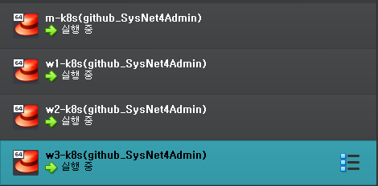
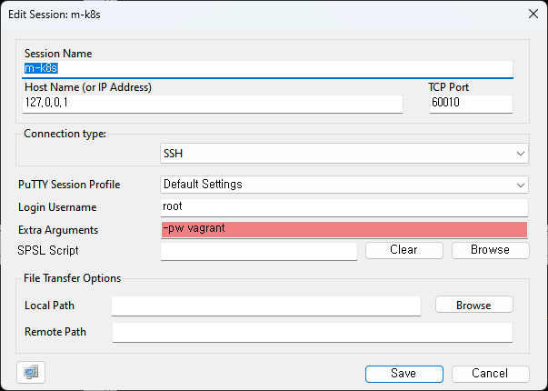

# Kubernetes-CICD

Kubernetes와 Jenkins 를 사용한 CICD 학습

# 


참고자료: 컨테이너 인프라 환경 구축을 위한 쿠버네티스/도커

활용법: https://github.com/sysnet4admin/_Book_k8sInfra

#

1. 가상화 인프라 환경 구성 

VirtualBox &  Vagrant - CentOS(Linux)

베이그런트는 사용자의 요구에 맞게 시스템 자원을 할당, 배치, 배포해 두었다가 필요할 때 시스템을 사용할 수 있는 상태로 만들어 줍니다.

2. 컨테이너 다루기

Kubernetes & Docker (CE)

쿠버네티스(Kubernetes)는 다수의 컨테이너(이 책에서는 도커를 사용)를 관리하는 데 사용합니다. 컨테이너의 자동 배포와 배포된 컨테이너에 대한 동작 보증, 부하에 따른 동적 확장 등의 기능을 제공합니다.

도커(Docker)는 컨테이너 환경에서 독립적으로 애플리케이션을 실행할 수 있도록 컨테이너를 만들고 관리하는 것을 도와주는 컨테이너 도구입니다.

3. CI CD

Jenkins

젠킨스(Jenkins)는 지속적 통합(CI, Continuous Integration)과 지속적 배포(CD, Continuous Deployment)를 지원합니다.

지속적 통합과 지속적 배포는 개발한 프로그램의 빌드, 테스트, 패키지화, 배포 단계를 모두 자동화해 개발 단계를 표준화합니다.

4. 컨테이너 인프라 환경 관리하기

Prometheus & Grafana

프로메테우스(Prometheus)와 그라파나(Grafana)는 모니터링을 위한 도구입니다. 프로메테우스는 상태 데이터를 수집하고, 그라파나는 프로메테우스로 수집한 데이터를 관리자가 보기 좋게 시각화합니다. 컨테이너 인프라 환경에서는 많은 종류의 소규모 기능이 각각 나누어 개발되기 때문에 중앙 모니터링이 필요합니다.

#

## Vagrant로 VirtualBox 접속하기

Vagrant 설치 파일 디렉토리로 이동. ( C:\Program Files (x86)\Vagrant )

command: vagrant ssh
초기 password: vagrant

### 가상 머신 추가로 구성하기

베이그런트로 운영 체제를 자동으로 설치하고 구성하면 편리합니다. 하지만 단순히 운영 체제
1개를 구성하려고 베이그런트를 사용하지는 않는다.

3개의 node 가상머신 구성. (w1-k8s, w2-k8s, w3-k8s)
1개의 root 가상머신 구성. (m-k8s)

## Vagrantfile 수정

책에 나온 대로 Vagrantfile을 수정.

설치

command: vagrant up

추가 패키지를 설치를 위해 Vagrantfile을 수정.

수정된 부분만 설치.

command: vagrant provision


## 가상머신 구성 완료 및 테스트

### 가상머신 구성 완료 사진


### ping test
```
[vagrant@m-k8s ~]$ ./ping_2_nds.sh
PING 192.168.1.101 (192.168.1.101) 56(84) bytes of data.
64 bytes from 192.168.1.101: icmp_seq=1 ttl=64 time=0.781 ms
64 bytes from 192.168.1.101: icmp_seq=2 ttl=64 time=2.55 ms
64 bytes from 192.168.1.101: icmp_seq=3 ttl=64 time=2.11 ms

--- 192.168.1.101 ping statistics ---
3 packets transmitted, 3 received, 0% packet loss, time 2235ms
rtt min/avg/max/mdev = 0.781/1.815/2.550/0.753 ms
PING 192.168.1.102 (192.168.1.102) 56(84) bytes of data.
64 bytes from 192.168.1.102: icmp_seq=1 ttl=64 time=1.13 ms
64 bytes from 192.168.1.102: icmp_seq=2 ttl=64 time=3.37 ms
64 bytes from 192.168.1.102: icmp_seq=3 ttl=64 time=2.13 ms

--- 192.168.1.102 ping statistics ---
3 packets transmitted, 3 received, 0% packet loss, time 2007ms
rtt min/avg/max/mdev = 1.138/2.218/3.378/0.917 ms
PING 192.168.1.103 (192.168.1.103) 56(84) bytes of data.
64 bytes from 192.168.1.103: icmp_seq=1 ttl=64 time=0.704 ms
64 bytes from 192.168.1.103: icmp_seq=2 ttl=64 time=1.70 ms
64 bytes from 192.168.1.103: icmp_seq=3 ttl=64 time=1.51 ms

--- 192.168.1.103 ping statistics ---
3 packets transmitted, 3 received, 0% packet loss, time 2009ms
rtt min/avg/max/mdev = 0.704/1.307/1.700/0.435 ms
```

## 터미널 프로그램으로 가상 머신 접속하기

### PuTTY

푸티를 단독으로 사용하면 창을 여러 개 띄워야 해서 명령을 내리기가 매우 번거롭습니다.
슈퍼푸티(SuperPuTTY)를 사용하면 푸티의 이런 제약 사항이 해결됩니다.

### Super PuTTY

https://github.com/jimradford/superputty/releases

SuperPuttySetup-1.5.0.0.msi

