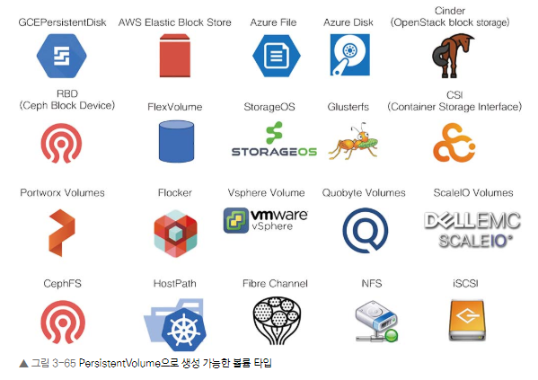
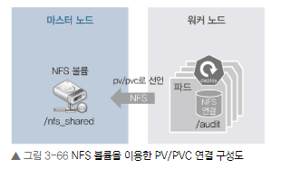

# 알아두면 쓸모 있는 쿠버네티스 오브젝트

- [알아두면 쓸모 있는 쿠버네티스 오브젝트](#알아두면-쓸모-있는-쿠버네티스-오브젝트)
- [](#)
- [](#-1)
  - [데몬셋](#데몬셋)
  - [컨피그맵](#컨피그맵)
  - [PV와 PVC](#pv와-pvc)
    - [NFS 볼륨에 PV/PVC를 만들고 파드에 연결하기](#nfs-볼륨에-pvpvc를-만들고-파드에-연결하기)
    - [NFS 볼륨을 파드에 직접 마운트하기](#nfs-볼륨을-파드에-직접-마운트하기)
      - [볼륨 용량을 제한하는 방법](#볼륨-용량을-제한하는-방법)
  - [스테이트풀셋](#스테이트풀셋)

# 
지금까지는 파드를 안정적으로 사용하는 방법을 배우며 파드를 관리하는 여러 가지 기능이 포함된 디플로이먼트 오브젝트를 사용해 봤다.


디플로이먼트 외에도 용도에 따라 사용할 수 있는 다양한 오브젝트가 이미 정의되어 있다.
#

## 데몬셋

데몬셋은 이미 여러 번 사용했다.

Calico 네트워크 플러그인과 kube-proxy를 생성할 때 사용했고, MetalLB의 스피커에서도 사용했다.

이들의 공통점은 노드의 단일 접속 지점으로 노드 외부와 통신하는 것

따라서 파드가 1개 이상 필요하지 않다.

결국 노드를 관리하는 파드라면 데몬셋으로 만드는 게 가장 효율적


1. `kubectl get pods -n metallb-system -o wide`를 실행해 현재 MetalLB의 스피커가 각 노드에 분포돼 있는 상태를 확인합니다.
2. 
```
[root@m-k8s ~]# kubectl get pods -n metallb-system -o wide
NAME                          READY   STATUS    RESTARTS   AGE   IP               NODE     NOMINATED NODE   READINESS GATES
controller-5d48db7f99-gdkps   1/1     Running   1          23h   172.16.103.153   w2-k8s   <none>           <none>
speaker-s8nwb                 1/1     Running   2          23h   192.168.1.101    w1-k8s   <none>           <none>
speaker-svlmm                 1/1     Running   2          23h   192.168.1.10     m-k8s    <none>           <none>
speaker-t2s2l                 1/1     Running   2          23h   192.168.1.102    w2-k8s   <none>           <none>
speaker-vdfzp                 1/1     Running   2          23h   192.168.1.103    w3-k8s   <none>           <none>
```

2. 워커 노드를 1개 늘립니다.

Vagrantfile의 N값을 3 -> 4로 수정.

3. 호스트 컴퓨터의 명령 창에서 `vagrant up w4-k8s`를 실행
새로운 워커 노드(w4-k8s)를 추가하는 명령

4. w4-k8s이 추가되면 m-k8s에서 `kubectl get pods -n metallb-system -o wide -w`를 수행합니다.

-w는 watch의 약어로 오브젝트 상태에 변화가 감지되면 해당 변화를 출력

리눅스에서 tail -f와 비슷한 역할

```
[root@m-k8s 3.1.3]# kubectl get pods -n metallb-system -o wide -w
NAME                          READY   STATUS    RESTARTS   AGE   IP               NODE     NOMINATED NODE   READINESS GATES
controller-5d48db7f99-gdkps   1/1     Running   1          23h   172.16.103.153   w2-k8s   <none>           <none>
speaker-s8nwb                 1/1     Running   2          23h   192.168.1.101    w1-k8s   <none>           <none>
speaker-svlmm                 1/1     Running   2          23h   192.168.1.10     m-k8s    <none>           <none>
speaker-t2s2l                 1/1     Running   2          23h   192.168.1.102    w2-k8s   <none>           <none>
speaker-vdfzp                 1/1     Running   2          23h   192.168.1.103    w3-k8s   <none>           <none>
speaker-5k9sm                 0/1     Pending   0          0s    <none>           <none>   <none>           <none>
speaker-5k9sm                 0/1     Pending   0          1s    <none>           w4-k8s   <none>           <none>
speaker-5k9sm                 0/1     ContainerCreating   0          1s    192.168.1.104    w4-k8s   <none>           <none>
speaker-5k9sm                 1/1     Running             0          12s   192.168.1.104    w4-k8s   <none>           <none>
```

5. 자동으로 추가된 노드에 설치된 스피커가 데몬셋이 맞는지 `kubectl get pods speaker-5k9sm -o yaml -n metallb-system`을 실행해 확인

스피커 이름(speaker-vnc2k)은 각자 생성된 이름으로

추가된 워커 노드에 데몬셋이 정상적으로 설치되고 작동하는 것을 확인해 봤습니다.


## 컨피그맵
컨피그맵(ConfigMap)은 이름 그대로 설정(config)을 목적으로 사용하는 오브젝트

MetalLB를 구성할 때 컨피그맵을 사용해봤다.

컨피그맵으로 작성된 MetalLB의 IP 설정을 변경해 봅시다.

1. 테스트용 디플로이먼트를 cfgmap이라는 이름으로 생성합니다.
```
[root@m-k8s ~]# kubectl create deployment cfgmap --image=sysnet4admin/echo-hname
deployment.apps/cfgmap created
```

2. cfgmap을 로드밸런서(MetalLB)를 통해 노출하고 이름은 cfgmap-svc로 지정합니다.
```
[root@m-k8s ~]# kubectl expose deployment cfgmap --type=LoadBalancer --name=cfgmap-svc --port=80
service/cfgmap-svc exposed
```

3. 생성된 서비스의 IP(192.168.1.11)를 확인합니다.
```
[root@m-k8s ~]# kubectl get services
NAME         TYPE           CLUSTER-IP      EXTERNAL-IP    PORT(S)        AGE
cfgmap-svc   LoadBalancer   10.96.218.230   192.168.1.11   80:32149/TCP   10s
kubernetes   ClusterIP      10.96.0.1       <none>         443/TCP        6d23h
```

4. 사전에 구성돼 있는 컨피그맵의 기존 IP(192.168.1.11~192.168.1.13)를 sed 명령을 사용해 192.168.1.21~192.168.1.23으로 변경합니다.
```
[root@m-k8s ~]# cat ~/_Book_k8sInfra/ch3/3.4.2/metallb-l2config.yaml | grep 192.
      - 192.168.1.11-192.168.1.13
[root@m-k8s ~]# sed -i 's/11/21/;s/13/23/' ~/_Book_k8sInfra/ch3/3.4.2/metallb-l2config.yaml
[root@m-k8s ~]# cat ~/_Book_k8sInfra/ch3/3.4.2/metallb-l2config.yaml | grep 192.
      - 192.168.1.21-192.168.1.23
```

5. 컨피그맵 설정 파일(metallb-l2config.yaml)에 apply를 실행해 변경된 설정을 적용합니다.
```
[root@m-k8s ~]# kubectl apply -f ~/_Book_k8sInfra/ch3/3.4.2/metallb-l2config.yaml
configmap/config configured
```

6. MetalLB와 관련된 모든 파드를 삭제합니다. 삭제하고 나면 kubelet에서 해당 파드를 자동으로 모두 다시 생성합니다. --all은 파드를 모두 삭제하는 옵션입니다.
```
[root@m-k8s ~]# kubectl delete pods --all -n metallb-system
pod "controller-5d48db7f99-gdkps" deleted
pod "speaker-5k9sm" deleted
pod "speaker-s8nwb" deleted
pod "speaker-svlmm" deleted
pod "speaker-t2s2l" deleted
pod "speaker-vdfzp" deleted
```

7. 새로 생성된 MetalLB의 파드들을 확인합니다.
```
[root@m-k8s ~]# kubectl get pods -n metallb-system
NAME                          READY   STATUS    RESTARTS   AGE
controller-5d48db7f99-8xn6x   1/1     Running   0          22s
speaker-nqr5r                 1/1     Running   0          22s
speaker-sfjpk                 1/1     Running   0          22s
speaker-vw78p                 1/1     Running   0          22s
speaker-wph9m                 1/1     Running   0          22s
speaker-xmf9h                 1/1     Running   0          22s
```

8. 기존에 노출한 MetalLB 서비스(cfgmap-svc)를 삭제(delete)하고 동일한 이름으로 다시 생성해 새로운 컨피그맵을 적용한 서비스가 올라오게 합니다.
```
[root@m-k8s ~]# kubectl delete service cfgmap-svc
service "cfgmap-svc" deleted
[root@m-k8s ~]# kubectl expose deployment cfgmap --type=LoadBalancer --name=cfgmap-svc --port=80
service/cfgmap-svc exposed
```

9. 변경된 설정이 적용돼 새로운 MetalLB 서비스의 IP가 192.168.1.21로 바뀌었는지 확인합니다.
```
[root@m-k8s ~]# kubectl get services
NAME         TYPE           CLUSTER-IP      EXTERNAL-IP    PORT(S)        AGE
cfgmap-svc   LoadBalancer   10.96.181.230   192.168.1.21   80:32372/TCP   17s
kubernetes   ClusterIP      10.96.0.1       <none>         443/TCP        6d23h
```

10. 호스트 컴퓨터의 브라우저에서 192.168.1.21로 접속해 파드의 이름이 화면에 표시되는지 확인합니다.
`cfgmap-8ddbf499-sncbc`

11. 이름이 표시되므로 설정 변경이 성공했습니다. 다음 테스트를 위해 생성한 디플로이먼트와 서비스를 삭제합니다.
```
[root@m-k8s ~]# kubectl delete deployment cfgmap
deployment.apps "cfgmap" deleted
[root@m-k8s ~]# kubectl delete service cfgmap-svc
service "cfgmap-svc" deleted
```


## PV와 PVC
파드는 언제라도 생성되고 지워진다

그러므로 파드에서 생성한 내용을 기록하고 보관하거나 모든 파드가 동일한 설정 값을 유지하고 관리하기 위해 공유된 볼륨으로부터 공통된 설정을 가지고 올 수 있도록 설계해야 할 때도 있다.

다양한 쿠버네티스 볼륨 스토리지 중에서 PV와 PVC를 설명


쿠버네티스는 필요할 때 PVC(PersistentVolumeClaim, 지속적으로 사용 가능한 볼륨 요청)를 요청해 사용

PVC를 사용하려면 PV(PersistentVolume, 지속적으로 사용 가능한 볼륨)로 볼륨을 선언해야함

PV로 볼륨을 선언할 수 있는 타입



NFS 볼륨 타입으로 PV와 PVC를 생성하고 파드에 마운트 해 보면서 실제로 어떻게 작동하는 지 확인하기.



### NFS 볼륨에 PV/PVC를 만들고 파드에 연결하기

1. PV로 선언할 볼륨을 만들기 위해 NFS 서버를 마스터 노드에 구성합니다.

공유되는 디렉터리는 /nfs_shared로 생성

해당 디렉터리를 NFS로 받아들일 IP 영역은 192.168.1.0/24로

옵션을 적용해 /etc/exports에 기록

rw는 읽기/쓰기, sync는 쓰기 작업 동기화, no_root_squash는 root 계정 사용을 의미

```
[root@m-k8s ~]# mkdir /nfs_shared
[root@m-k8s ~]# echo '/nfs_shared 192.168.1.0/24(rw,sync,no_root_squash)' >> /etc/exports
```

2. 해당 내용을 시스템에 적용해 NFS 서버를 활성화하고 다음에 시작할 때도 자동으로 적용되도록 systemctl enable --now nfs 명령을 실행합니다.
```
[root@m-k8s ~]# systemctl enable --now nfs
Created symlink from /etc/systemd/system/multi-user.target.wants/nfs-server.service to /usr/lib/systemd/system/nfs-server.service.
```

3. 다음 경로에 있는 오브젝트 스펙을 실행해 PV를 생성합니다.
```
[root@m-k8s ~]# kubectl apply -f ~/_Book_k8sInfra/ch3/3.4.3/nfs-pv.yaml
persistentvolume/nfs-pv created
```

storage는 실제로 사용하는 용량을 제한하는 것이 아니라 쓸 수 있는 양을 레이블로 붙이는 것

현재 스토리지가 단순히 NFS로 설정돼서 그렇다.

ReadWriteMany는 여러 개의 노드가 읽고 쓸 수 있도록 마운트하는 옵션

persistentVolumeReclaimPolicy는 PVC가 제거됐을 때 PV가 작동하는 방법을 정의

유지하는 Retain을 사용

그 외에도 Delete(삭제)와 Recycle(재활용, Deprecated) 옵션

NFS 서버의 연결 위치에 대한 설정

4. `kubectl get pv`를 실행해 생성된 PV의 상태가 Available(사용 가능)임을 확인합니다.
```
[root@m-k8s ~]# kubectl get pv
NAME     CAPACITY   ACCESS MODES   RECLAIM POLICY   STATUS      CLAIM   STORAGECLASS   REASON   AGE
nfs-pv   100Mi      RWX            Retain           Available                                   90s
```

5. 다음 경로에서 오브젝트 스펙을 실행해 PVC를 생성합니다.
```
[root@m-k8s ~]# kubectl apply -f ~/_Book_k8sInfra/ch3/3.4.3/nfs-pvc.yaml
persistentvolumeclaim/nfs-pvc created
```

6. 생성된 PVC를 kubectl get pvc로 확인합니다.
```
[root@m-k8s ~]# kubectl get pvc
NAME      STATUS   VOLUME   CAPACITY   ACCESS MODES   STORAGECLASS   AGE
nfs-pvc   Bound    nfs-pv   100Mi      RWX                           22s
```

- 상태가 Bound(묶여짐)로 변경됐다는 것
 PV와 PVC가 연결됐음을 의미한다.

- 용량이 설정한 10Mi가 아닌 100Mi라는 것
사실 용량은 동적으로 PVC를 따로 요청해 생성하는 경우가 아니면 큰 의미가 없다.

7. PV의 상태도 Bound로 바뀌었음을 kubectl get pv로 확인합니다.
```
[root@m-k8s ~]# kubectl get pv
NAME     CAPACITY   ACCESS MODES   RECLAIM POLICY   STATUS   CLAIM             STORAGECLASS   REASON   AGE
nfs-pv   100Mi      RWX            Retain           Bound    default/nfs-pvc                           3m23s
```

8. 생성한 PVC를 볼륨으로 사용하는 디플로이먼트 오브젝트 스펙을 배포합니다.
```
[root@m-k8s ~]# kubectl apply -f ~/_Book_k8sInfra/ch3/3.4.3/nfs-pvc-deploy.yaml
deployment.apps/nfs-pvc-deploy created
```

audit-trail 이미지를 가지고 옵니다. 해당 컨테이너 이미지는 요청을 처리할 때마다 접속 정보를 로그로 기록합니다.

볼륨이 마운트될 위치(/audit)를 지정

PVC로 생성된 볼륨을 마운트하기 위해서 nfs-pvc라는 이름을 사용

9. 생성된 파드를 확인합니다.
```
[root@m-k8s ~]# kubectl get pods
NAME                              READY   STATUS    RESTARTS   AGE
nfs-pvc-deploy-5fd9876c46-hxm8t   1/1     Running   0          40s
nfs-pvc-deploy-5fd9876c46-mn9pd   1/1     Running   0          40s
nfs-pvc-deploy-5fd9876c46-sqjwg   1/1     Running   0          40s
nfs-pvc-deploy-5fd9876c46-vdx74   1/1     Running   0          40s
```

10. 생성한 파드 중 하나에 exec로 접속합니다.
`kubectl exec -it nfs-pvc-deploy-5fd9876c46-hxm8t -- /bin/bash`

11. `df -h`를 실행해 PVC의 마운트 상태를 확인합니다.
```
root@nfs-pvc-deploy-5fd9876c46-hxm8t:/# df -h
Filesystem                   Size  Used Avail Use% Mounted on
overlay                       37G  3.4G   34G  10% /
tmpfs                        1.3G     0  1.3G   0% /dev
tmpfs                        1.3G     0  1.3G   0% /sys/fs/cgroup
192.168.1.10:/nfs_shared      37G  3.6G   34G  10% /audit
/dev/mapper/centos_k8s-root   37G  3.4G   34G  10% /etc/hosts
shm                           64M     0   64M   0% /dev/shm
tmpfs                        1.3G   12K  1.3G   1% /run/secrets/kubernetes.io/serviceaccount
tmpfs                        1.3G     0  1.3G   0% /proc/acpi
tmpfs                        1.3G     0  1.3G   0% /proc/scsi
tmpfs                        1.3G     0  1.3G   0% /sys/firmware
```

12. 오른쪽에 m-k8s 명령 창을 1개 더 열고 audit-trail 컨테이너의 기능을 테스트합니다.
`kubectl expose deployment nfs-pvc-deploy --type=LoadBalancer --name=nfs-pvc-deploy-svc --port=80`

13. 생성한 로드밸런서 서비스의 IP를 확인합니다.
```
[root@m-k8s ~]# kubectl get services
NAME                 TYPE           CLUSTER-IP     EXTERNAL-IP    PORT(S)        AGE
kubernetes           ClusterIP      10.96.0.1      <none>         443/TCP        6d23h
nfs-pvc-deploy-svc   LoadBalancer   10.96.48.150   192.168.1.21   80:31592/TCP   19s
```

14. 호스트 컴퓨터에서 브라우저를 엽니다. 192.168.1.21에 접속해 파드 이름과 IP가 표시되는지 확인합니다.
`pod_n: nfs-pvc-deploy-5fd9876c46-hxm8t | ip_dest: 172.16.221.153`

15. exec를 통해 접속한 파드에서 ls /audit 명령을 실행해 접속 기록 파일이 남았는지 확인합니다. cat으로 해당 파일의 내용도 함께 확인합니다.
```
root@nfs-pvc-deploy-5fd9876c46-hxm8t:/# ls /audit
audit_nfs-pvc-deploy-5fd9876c46-hxm8t.log
root@nfs-pvc-deploy-5fd9876c46-hxm8t:/# cat /audit/audit_nfs-pvc-deploy-5fd9876c46-hxm8t.log
16/Nov/2023:14:24:17 +0900  172.16.221.153  GET
16/Nov/2023:14:24:17 +0900  172.16.221.153  GET
```

16. 마스터 노드(m-k8s)에서 scale 명령으로 파드를 4개에서 8개로 증가시킵니다.s
`kubectl scale deployment nfs-pvc-deploy --replicas=8`

17. 생성된 파드를 확인합니다.
```
[root@m-k8s ~]# kubectl get pods
NAME                              READY   STATUS    RESTARTS   AGE
nfs-pvc-deploy-5fd9876c46-8cfzt   1/1     Running   0          8s
nfs-pvc-deploy-5fd9876c46-hsgk4   1/1     Running   0          8s
nfs-pvc-deploy-5fd9876c46-hxm8t   1/1     Running   0          3m48s
nfs-pvc-deploy-5fd9876c46-khcl8   1/1     Running   0          8s
nfs-pvc-deploy-5fd9876c46-mn9pd   1/1     Running   0          3m48s
nfs-pvc-deploy-5fd9876c46-nccfw   1/1     Running   0          8s
nfs-pvc-deploy-5fd9876c46-sqjwg   1/1     Running   0          3m48s
nfs-pvc-deploy-5fd9876c46-vdx74   1/1     Running   0          3m48s
```

18. 최근에 증가한 4개의 파드 중 1개를 선택해 exec로 접속하고 기록된 audit 로그가 동일한지 확인합니다.
`kubectl exec -it nfs-pvc-deploy-5fd9876c46-8cfzt -- /bin/bash`
```
root@nfs-pvc-deploy-5fd9876c46-8cfzt:/# cat /audit/audit_nfs-pvc-deploy-5fd9876c46-hxm8t.log
16/Nov/2023:14:24:17 +0900  172.16.221.153  GET
16/Nov/2023:14:24:17 +0900  172.16.221.153  GET
```

19. 다른 브라우저를 열고 192.168.1.21로 접속해 다른 파드 이름과 IP가 표시되는지를 확인합니다.
`pod_n: nfs-pvc-deploy-5fd9876c46-nccfw | ip_dest: 172.16.103.156`

20. exec로 접속한 파드에서 ls /audit을 실행해 새로 추가된 audit 로그를 확인합니다. 그리고 cat으로 기록된 내용도 함께 확인합니다.
```
root@nfs-pvc-deploy-5fd9876c46-8cfzt:/# ls /audit/
audit_nfs-pvc-deploy-5fd9876c46-hxm8t.log  audit_nfs-pvc-deploy-5fd9876c46-nccfw.log
audit_nfs-pvc-deploy-5fd9876c46-khcl8.log
root@nfs-pvc-deploy-5fd9876c46-8cfzt:/# cat /audit/audit_nfs-pvc-deploy-5fd9876c46-nccfw.log
16/Nov/2023:14:27:12 +0900  172.16.103.156  GET
16/Nov/2023:14:27:12 +0900  172.16.103.156  GET
```

21. 기존에 접속한 파드에서도 동일한 로그가 audit에 기록돼 있는지 확인합니다.
```
root@nfs-pvc-deploy-5fd9876c46-hxm8t:/# ls /audit
audit_nfs-pvc-deploy-5fd9876c46-hxm8t.log  audit_nfs-pvc-deploy-5fd9876c46-nccfw.log
audit_nfs-pvc-deploy-5fd9876c46-khcl8.log
```

### NFS 볼륨을 파드에 직접 마운트하기

1.  볼륨을 마운트하는지 확인
사용자가 관리자와 동일한 단일 시스템이라면 PV와 PVC를 사용할 필요가 없습니다.

```
[root@m-k8s ~]# kubectl apply -f ~/_Book_k8sInfra/ch3/3.4.3/nfs-ip.yaml
deployment.apps/nfs-ip created
```

2. 새로 배포된 파드를 확인하고 그중 하나에 exec로 접속합니다.
```
[root@m-k8s ~]# kubectl get pods
NAME                              READY   STATUS    RESTARTS   AGE
nfs-ip-7789f445b7-86vnp           1/1     Running   0          117s
nfs-ip-7789f445b7-hl4kw           1/1     Running   0          117s
nfs-ip-7789f445b7-mrd6w           1/1     Running   0          117s
nfs-ip-7789f445b7-xbwdb           1/1     Running   0          117s
[생략]
[root@m-k8s ~]# kubectl exec -it nfs-ip-7789f445b7-86vnp -- /bin/bash
root@nfs-ip-7789f445b7-86vnp:/#
```

3. 접속한 파드에서 ls /audit를 실행해 동일한 NFS 볼륨을 바라보고 있음을 확인합니다.
```
root@nfs-ip-7789f445b7-86vnp:/# ls /audit
audit_nfs-pvc-deploy-5fd9876c46-hxm8t.log  audit_nfs-pvc-deploy-5fd9876c46-nccfw.log
audit_nfs-pvc-deploy-5fd9876c46-khcl8.log
```

4. 다음 진행을 위해 설치한 PV와 PVC를 제외한 나머지인 파드와 서비스를 삭제합니다.
```
[root@m-k8s ~]# kubectl delete deployment nfs-pvc-deploy
deployment.apps "nfs-pvc-deploy" deleted
[root@m-k8s ~]# kubectl delete deployment nfs-ip
deployment.apps "nfs-ip" deleted
[root@m-k8s ~]# kubectl delete service nfs-pvc-deploy-svc
service "nfs-pvc-deploy-svc" deleted
```

#### 볼륨 용량을 제한하는 방법 
p.81 ~

## 스테이트풀셋