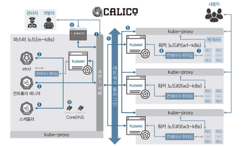

# 쿠버네티스 기본 구성

- [쿠버네티스 기본 구성](#쿠버네티스-기본-구성)
- [](#)
  - [가상 머신으로 쿠버네티스 실습 환경을 구축](#가상-머신으로-쿠버네티스-실습-환경을-구축)
  - [Kubernetes 클러스터에 마스터 노드와 워커 노드 생성 및 연결 확인.](#kubernetes-클러스터에-마스터-노드와-워커-노드-생성-및-연결-확인)
  - [kuberctl](#kuberctl)
  - [kuberlet](#kuberlet)
    - [kubelet 서비스 멈추기](#kubelet-서비스-멈추기)
  - [kube-proxy](#kube-proxy)

#

## 가상 머신으로 쿠버네티스 실습 환경을 구축

3.1.3 폴더의 파일들을 활용하여 Kubernetes 실습 환경 구축.

Vagrant up 명령어로 설치.

각 파일들의 코드 설명은 p.38 ~ p.40 까지 자세히 기술되어 있음.

## Kubernetes 클러스터에 마스터 노드와 워커 노드 생성 및 연결 확인.

superPuTTy에서 m-k8s를 실행.

command: `kubectl get nodes`

```
[root@m-k8s ~]# kubectl get nodes
NAME     STATUS     ROLES    AGE     VERSION
m-k8s    Ready      master   7m48s   v1.18.4
w1-k8s   Ready      <none>   5m7s    v1.18.4
w2-k8s   Ready      <none>   2m37s   v1.18.4
w3-k8s   NotReady   <none>   20s     v1.18.4
```



## kuberctl

kubectl은 꼭 마스터 노드에 위치할 필요 없다

어느 곳에서든지 kubectl을 실행하려면 어떤 부분이 필요한가? p.44

## kuberlet

kubelet은 쿠버네티스에서 파드의 생성과 상태 관리 및 복구 등을 담당하는 매우 중요한 구성 요소입니다. 따라서 kubelet에 문제가 생기면 파드가 정상적으로 관리되지 않습니다.

- 기능을 검증하려면 실제로 파드를 배포해야 합니다.
- m-k8s(마스터 노드)에서 kubectl create -f ~/_Book_k8sInfra/ch3/3.1.6/nginx-pod.yaml 명령으로 nginx 웹 서버 파드를 배포

`kubectl get pod`

```
[root@m-k8s ~]# kubectl get pod
NAME        READY   STATUS              RESTARTS   AGE
nginx-pod   0/1     ContainerCreating   0          7s
```

`kubectl get pods -o wide`
- 파드가 배포된 워커 노드를 확인
  
```
[root@m-k8s ~]# kubectl get pods -o wide
NAME        READY   STATUS    RESTARTS   AGE   IP             NODE     NOMINATED NODE   READINESS GATES
nginx-pod   1/1     Running   0          36s   172.16.132.1   w3-k8s   <none>           <none>
```

w3-k8s node가 배포된 것을 알 수 있음.

### kubelet 서비스 멈추기

1. 배포된 node에 접속해 `systemctl stop kubelet`으로 kubelet 서비스를 멈춤.
2. 마스터 node에서 `kubectl get pod` 으로 상태 확인.
3. ` kubectl delete pod nginx-pod` 명령으로 pod 삭제.

슈퍼푸티 명령 창에 아무런 변화가 없다면?

- 명령 취소. `Ctrl + c`
- kubectl get pod 명령을 실행해 파드의 상태를 확인
- 배포된 node에 접속해 systemctl start kubelet을 실행해 kubelet을 복구
- 마스터 node에서 kubelet get pod 명령을 실행해 nginx-pod가 삭제됐는지 확인

```
[root@m-k8s ~]# kubectl get pod
No resources found in default namespace.
```


## kube-proxy
kubelet이 파드의 상태를 관리한다면 kube-proxy는 파드의 통신을 담당합니다.


- `kubectl create -f ~/_Book_k8sInfra/ch3/3.1.6/nginx-pod.yaml`
- `kubectl get pod -o wide`
```
NAME        READY   STATUS    RESTARTS   AGE   IP               NODE     NOMINATED NODE   READINESS GATES
nginx-pod   1/1     Running   0          29s   172.16.221.129   w1-k8s   <none>           <none>
```
- 마스터 node에서 `curl 172.16.221.129` 명령어 실행
- 배포된 node에서 `modprobe -r br_netfilter` 명령으로 파드가 위치한 워커 노드에서 br_netfilter 모듈을 제거
- 배포된 node에서 `systemctl restart network` 명령을 실행한 후 마스터 node에서 문제 상황을 직시.
- 마스터 node에서 `curl 172.16.221.129` 명령어 실행
```
[root@m-k8s ~]# curl 172.16.221.129
curl: (7) Failed connect to 172.16.221.129:80; Connection timed out
```
- `kubectl get pod -o wide` 를 실행해 파드 상태를 확인합니다.
```
NAME        READY   STATUS    RESTARTS   AGE     IP               NODE     NOMINATED NODE   READINESS GATES
nginx-pod   1/1     Running   0          5m20s   172.16.221.129   w1-k8s   <none>           <none>
```
- 배포된 node에서 `modprobe br_netfilter` 명령을 실행해 br_netfilter를 커널에 적재하고 시스템을 다시 시작해 `reboot` 적용합니다.

- 마스터 node에서 `kubectl get pod -o wide` 명령어 실행 (대기 시간 걸림. IP 부분이 생겨야 함.)
```
NAME        READY   STATUS    RESTARTS   AGE     IP               NODE     NOMINATED NODE   READINESS GATES
nginx-pod   1/1     Running   1          7m13s   172.16.221.130   w1-k8s   <none>           <none>
```
- 바뀐 IP로 curl 명령을 실행 `curl 172.16.221.130`
- 파드로부터 정보를 정상적으로 받아오는지 확인.