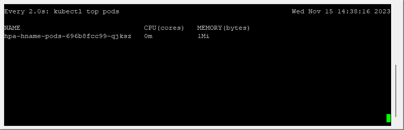
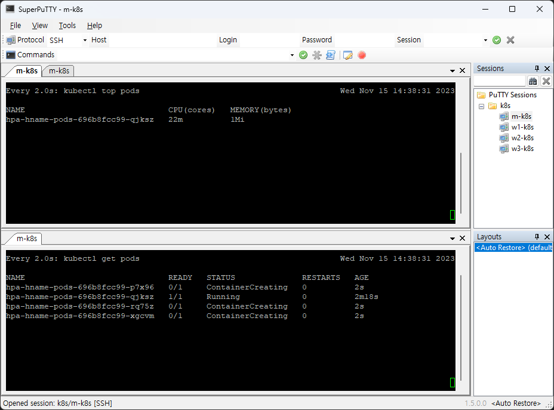
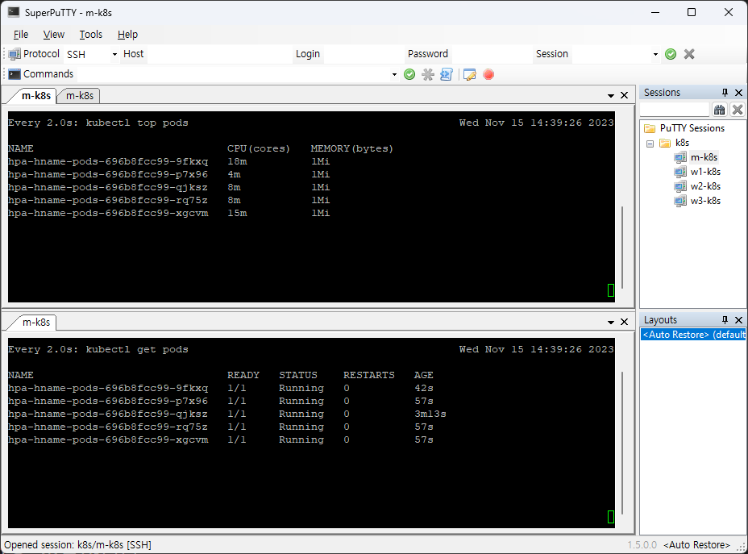
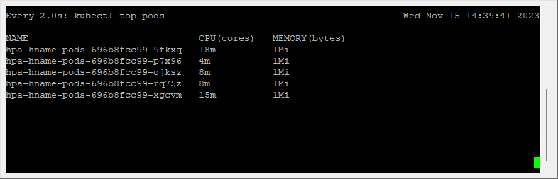

# 쿠버네티스 연결을 담당하는 서비스

- [쿠버네티스 연결을 담당하는 서비스](#쿠버네티스-연결을-담당하는-서비스)
- [](#)
  - [가장 간단하게 연결하는 노드포트](#가장-간단하게-연결하는-노드포트)
    - [노트포드 서비스로 외부에서 접속하기](#노트포드-서비스로-외부에서-접속하기)
    - [부하 분산 테스트하기](#부하-분산-테스트하기)
      - [어떻게 추가된 파드를 외부에서 추적해 접속하는 것일까요?](#어떻게-추가된-파드를-외부에서-추적해-접속하는-것일까요)
    - [expose로 노드포트 서비스 생성하기](#expose로-노드포트-서비스-생성하기)
  - [사용 목적별로 연결하는 인그레스](#사용-목적별로-연결하는-인그레스)
  - [클라우드에서 쉽게 구성 가능한 로드밸런서](#클라우드에서-쉽게-구성-가능한-로드밸런서)
  - [온프레미스에서 로드밸런서를 제공하는 MetalLB](#온프레미스에서-로드밸런서를-제공하는-metallb)
  - [부하에 따라 자동으로 파드 수를 조절하는 HPA](#부하에-따라-자동으로-파드-수를-조절하는-hpa)
    - [만약 쿠버네티스 메트릭 서버의 소스를 그대로 내려받아 실행하면 앞의 설정이 적용되지 않아 다음과 같은 에러가 발생합니다](#만약-쿠버네티스-메트릭-서버의-소스를-그대로-내려받아-실행하면-앞의-설정이-적용되지-않아-다음과-같은-에러가-발생합니다)

# 

## 가장 간단하게 연결하는 노드포트

외부에서 쿠버네티스 클러스터의 내부에 접속하는 가장 쉬운 방법은 노드포트(NodePort) 서비스를 이용하는 것

### 노트포드 서비스로 외부에서 접속하기

1. 디플로이먼트로 파드를 생성합니다.

이때 이미지는 sysnet4admin 계정에 있는 echo-hname을 사용합니다.

`kubectl create deployment np-pods --image=sysnet4admin/echo-hname`


2. 배포된 파드를 확인합니다.

```
[root@m-k8s ~]# kubectl get pods
NAME                       READY   STATUS    RESTARTS   AGE
np-pods-5767d54d4b-qchq6   1/1     Running   0          14s
```

3. kubectl create로 노드포트 서비스를 생성합니다.
`kubectl create -f ~/_Book_k8sInfra/ch3/3.3.1/nodeport.yaml`

사용하는 오브젝트 스펙은 다음과 같습니다.
```
apiVersion: v1
kind: Service
metadata:
  name: np-svc
spec:
  selector:
    app: np-pods 
  ports:
    - name: http
      protocol: TCP
      port: 80
      targetPort: 80
      nodePort: 30000
  type: NodePort
```


4. `kubectl get services`를 실행해 노드포트 서비스로 생성한 np-svc 서비스를 확인합니다.

```
[root@m-k8s ~]# kubectl get services
NAME         TYPE        CLUSTER-IP      EXTERNAL-IP   PORT(S)        AGE
kubernetes   ClusterIP   10.96.0.1       <none>        443/TCP        5d3h
np-svc       NodePort    10.111.210.34   <none>        80:30000/TCP   2m
```

5. 쿠버네티스 클러스터의 워커 노드 IP를 확인
```
[root@m-k8s ~]# kubectl get nodes -o wide
NAME     STATUS   ROLES    AGE    VERSION   INTERNAL-IP     EXTERNAL-IP   OS-IMAGE                KERNEL-VERSION                CONTAINER-RUNTIME
m-k8s    Ready    master   5d3h   v1.18.4   192.168.1.10    <none>        CentOS Linux 7 (Core)   3.10.0-1160.90.1.el7.x86_64   docker://1.13.1
w1-k8s   Ready    <none>   5d3h   v1.18.4   192.168.1.101   <none>        CentOS Linux 7 (Core)   3.10.0-1160.90.1.el7.x86_64   docker://1.13.1
w2-k8s   Ready    <none>   5d3h   v1.18.4   192.168.1.102   <none>        CentOS Linux 7 (Core)   3.10.0-1160.90.1.el7.x86_64   docker://1.13.1
w3-k8s   Ready    <none>   5d3h   v1.18.4   192.168.1.103   <none>        CentOS Linux 7 (Core)   3.10.0-1160.90.1.el7.x86_64   docker://1.13.1
```

6. 해당 ip 주소의 30000번 포트 번호로 외부에서 접속되는 지 확인.

w1-k8s ~ w3-k8s
```
np-pods-5767d54d4b-qchq6
np-pods-5767d54d4b-qchq6
np-pods-5767d54d4b-qchq6
```

### 부하 분산 테스트하기

1. 명령 창을 띄우고 다음 명령을 실행
   
이 명령은 반복적으로 192.168.1.101:30000에 접속해 접속한 파드 이름을 화면에 표시(Invoke-RestMethod)합니다. 이렇게 하면 파드가 1개에서 3개로 늘어나는 시점을 관찰할 수 있습니다.

2. 파워셸로 코드를 실행하고 나면 쿠버네티스 마스터 노드에서 scale을 실행해 파드를 3개로 증가시킵니다.
```
root@m-k8s ~]# kubectl scale deployment np-pods --replicas=3
deployment.apps/np-pods scaled
```

3. 배포된 파드를 확인합니다.
[root@m-k8s ~]# kubectl get pods
NAME                       READY   STATUS    RESTARTS   AGE
np-pods-5767d54d4b-k724j   1/1     Running   0          13s
np-pods-5767d54d4b-qchq6   1/1     Running   0          7m1s
np-pods-5767d54d4b-w5zsg   1/1     Running   0          13s

4. 파워셸 명령 창을 확인해 표시하는 파드 이름에 배포된 파드 3개가 돌아가면서 표시되는지 확인합니다.

부하 분산이 제대로 되는지 확인하기.

`각각의 파드 name이 번갈아 가면서 표시된다.`

#### 어떻게 추가된 파드를 외부에서 추적해 접속하는 것일까요?
이는 노드포트의 오브젝트 스펙에 적힌 np-pods와 디플로이먼트의 이름을 확인해 동일하면 같은 파드라고 간주하기 때문입니다.


### expose로 노드포트 서비스 생성하기

1. expose 명령어를 사용해 서비스로 내보낼 디플로이먼트를 np-pods로 지정합니다.
`kubectl expose deployment np-pods --type=NodePort --name=np-svc-v2 --port=80`

해당 서비스의 이름은 np-svc-v2로, 타입은 NodePort로 지정합니다. 서비스가 파드로 보내줄 연결 포트를 80번으로 지정

2. `kubectl get services`를 실행해 생성된 서비스를 확인합니다.

`30004번`으로 새로 생성된 노드의 포트 번호를 볼 수 있다.
```
[root@m-k8s ~]# kubectl get services
NAME         TYPE        CLUSTER-IP       EXTERNAL-IP   PORT(S)        AGE
kubernetes   ClusterIP   10.96.0.1        <none>        443/TCP        5d3h
np-svc       NodePort    10.111.210.34    <none>        80:30000/TCP   8m26s
np-svc-v2    NodePort    10.109.210.149   <none>        80:30004/TCP   30s
```

3. 해당 ip 주소의 30004번 포트 번호로 외부에서 접속되는 지 확인.


4. 노드포트로 쿠버네티스 클러스터 내부에 접속하는 방법을 알아봤습니다.

배포한 디플로이먼트와 서비스 2개를 모두 삭제
`kubectl delete deployment np-pods`    -> deployment pods를 삭제
`kubectl delete services np-svc`       -> services 1을 삭제
`kubectl delete services np-svc-v2`    -> services 2를 삭제

```
[root@m-k8s ~]# kubectl get pods
No resources found in default namespace.
```
```
[root@m-k8s ~]# kubectl get services
NAME         TYPE        CLUSTER-IP   EXTERNAL-IP   PORT(S)   AGE
kubernetes   ClusterIP   10.96.0.1    <none>        443/TCP   5d3h
```

## 사용 목적별로 연결하는 인그레스

노드포트 서비스는 포트를 중복 사용할 수 없어서 1개의 노드포트에 1개의 디플로이먼트만 적용

여러 개의 디플로이먼트가 있을 때 그 수만큼 노드포트 서비스를 구동해야 할까

쿠버네티스에서는 이런 경우에 인그레스를 사용

인그레스(Ingress)는 고유한 주소를 제공해 사용 목적에 따라 다른 응답을 제공할 수 있고, 트래픽에 대한 L4/L7 로드밸런서와 보안 인증서를 처리하는 기능을 제공합니다.

인그레스를 사용하려면 인그레스 컨트롤러가 필요

쿠버네티스에서 프로젝트로 지원하는 NGINX 인그레스 컨트롤러로 구성.

NGINX 인그레스 컨트롤러가 다음 단계로 작동

1. 사용자는 노드마다 설정된 노드포트를 통해 노드포트 서비스로 접속합니다.

이때 노드포트 서비스를 NGINX 인그레스 컨트롤러로 구성합니다.

2. NGINX 인그레스 컨트롤러는 사용자의 접속 경로에 따라 적합한 클러스터 IP 서비스로 경로를 제공합니다.

3. 클러스터 IP 서비스는 사용자를 해당 파드로 연결해 줍니다


1. 테스트용으로 디플로이먼트 2개(in-hname-pod, in-ip-pod)를 배포합니다.
```
[root@m-k8s ~]# kubectl create deployment in-hname-pod --image=sysnet4admin/echo-hname
deployment.apps/in-hname-pod created
[root@m-k8s ~]# kubectl create deployment in-ip-pod --image=sysnet4admin/echo-ip
deployment.apps/in-ip-pod created
```
2. 배포된 파드의 상태를 확인합니다.
```
[root@m-k8s ~]# kubectl get pods
NAME                            READY   STATUS    RESTARTS   AGE
in-hname-pod-8565c86448-cpk7d   1/1     Running   0          17s
in-ip-pod-76bf6989d-2rgxn       1/1     Running   0          13s
```
3. NGINX 인그레스 컨트롤러를 설치합니다.
`kubectl apply -f ~/_Book_k8sInfra/ch3/3.3.2/ingress-nginx.yaml`

4. NGINX 인그레스 컨트롤러의 파드가 배포됐는지 확인합니다.
NGINX 인그레스 컨트롤러는 default 네임스페이스가 아닌 ingress-nginx 네임스페이스에 속하므로 -n ingress-nginx 옵션을 추가해야 합니다.

여기서 -n은 namespace의 약어로, default 외의 네임스페이스를 확인할 때 사용하는 옵션

파드뿐만 아니라 서비스를 확인할 때도 동일한 옵션을 줍니다.

```
[root@m-k8s ~]# kubectl get pods -n ingress-nginx
NAME                                        READY   STATUS    RESTARTS   AGE
nginx-ingress-controller-5bb8fb4bb6-l4k74   1/1     Running   0          59s
```

5. 인그레스를 사용자 요구 사항에 맞게 설정하려면 경로와 작동을 정의해야 합니다.
`kubectl apply -f ~/_Book_k8sInfra/ch3/3.3.2/ingress-config.yaml`

외부에서 주소 값과 노드포트를 가지고 들어오는 것은 hname-svc-default 서비스와 연결된 파드로 넘기고,

외부에서 들어오는 주소 값, 노드포트와 함께 뒤에 /ip를 추가한 주소 값은 ip-svc 서비스와 연결된 파드로 접속하게 설정

6. 인그레스 설정 파일이 제대로 등록됐는지 `kubectl get ingress`로 확인합니다.
```
[root@m-k8s ~]# kubectl get ingress
NAME            CLASS    HOSTS   ADDRESS   PORTS   AGE
ingress-nginx   <none>   *                 80      62s
```

7. `kubectl get ingress -o yaml`을 실행해 인그레스에 요청한 내용이 확실하게 적용됐는지 확인합니다.

8. NGINX 인그레스 컨트롤러 생성과 인그레스 설정을 완료했습니다.
이제 외부에서 NGINX 인그레스 컨트롤러에 접속할 수 있게 노드포트 서비스로 NGINX 인그레스 컨트롤러를 외부에 노출합니다.

`kubectl apply -f ~/_Book_k8sInfra/ch3/3.3.2/ingress.yaml`

http -> 30100번 포트로 들어온 요청을 80번 포트로 넘기고
https -> https를 처리하기 위해 30101번 포트로 들어온 것을 443번 포트로 넘깁니다.

NGINX 인그레스 컨트롤러가 위치하는 네임스페이스를 ingress-nginx로 지정하고 NGINX 인그레스 컨트롤러의 요구 사항에 따라 셀렉터를 ingress-nginx로 지정

9. 노드포트 서비스로 생성된 NGINX 인그레스 컨트롤러(nginx-ingress-controller)를 확인합니다.
이때도 -n ingress-nginx로 네임스페이스를 지정해야만 내용을 확인할 수 있습니다.

```
[root@m-k8s ~]# kubectl get services -n ingress-nginx
NAME                       TYPE       CLUSTER-IP       EXTERNAL-IP   PORT(S)                      AGE
nginx-ingress-controller   NodePort   10.107.103.111   <none>        80:30100/TCP,443:30101/TCP   81s
```

10. expose 명령으로 디플로이먼트(in-hname-pod, in-ip-pod)도 서비스로 노출합니다.
`kubectl expose deployment in-hname-pod --name=hname-svc-default --port=80,443`
`kubectl expose deployment in-ip-pod --name=ip-svc --port=80,443`

11. 생성된 서비스를 점검해 디플로이먼트들이 서비스에 정상적으로 노출되는지 확인합니다.

```
[root@m-k8s ~]# kubectl get pods
NAME                            READY   STATUS    RESTARTS   AGE
in-hname-pod-8565c86448-cpk7d   1/1     Running   0          5m45s
in-ip-pod-76bf6989d-2rgxn       1/1     Running   0          5m41s
```

12. ip와 포트번호로 접속하여 외부에서 접속되는 경로에 따라 다르게 작동하는 지 확인합니다.

http://192.168.1.102:30100/   -> `in-hname-pod-8565c86448-cpk7d`

13. 해당 ip에 /ip를 추가해서 반환되는지 확인합니다.

http://192.168.1.102:30100/ip -> `request_method : GET | ip_dest: 172.16.103.146`

14. https://192.168.1.101:30101 으로 접속해 HTTP 연결이 아닌 HTTPS 연결도 정상적으로 작동하는지 확인합니다.

https://192.168.1.102:30101/  -> `in-hname-pod-8565c86448-cpk7d`

15.  https://192.168.1.101:30101/ip 를 입력해 마찬가지로 요청 방법과 파드의 IP 주소가 웹 브라우저에 표시되는지 확인합니다.

https://192.168.1.101:30101/ip -> `request_method : GET | ip_dest: 172.16.103.146`

16. NGINX 인그레스 컨트롤러 구성과 테스트가 끝났습니다.
다음 실습 진행을 위해 배포한 디플로이먼트와 모든 서비스를 삭제합니다.

```
[root@m-k8s ~]# kubectl delete deployment in-hname-pod
deployment.apps "in-hname-pod" deleted
[root@m-k8s ~]# kubectl delete deployment in-ip-pod
deployment.apps "in-ip-pod" deleted
[root@m-k8s ~]# kubectl delete services hname-svc-default
service "hname-svc-default" deleted
[root@m-k8s ~]# kubectl delete services ip-svc
service "ip-svc" deleted
```

17. NGINX 인그레스 컨트롤러와 관련된 내용도 모두 삭제합니다.

`kubectl delete -f ~/_Book_k8sInfra/ch3/3.3.2/ingress-nginx.yaml`


## 클라우드에서 쉽게 구성 가능한 로드밸런서

현재까지의 연결 방식은 들어오는 요청을 모두 워커 노드의 노드포트를 통해 서비스로 이동하고 이를 다시 kubernetes의 pod로 보내는 구조였다.

이는 매우 비효율적이다.

따라서 로드밸런서라는 서비스 타입을 제공해 간단한 구조로 pod를 외부에 노출하고 부하를 분산한다.

로드밸런서를 사용하려면 로드밸런서를 이미 구현해 둔 서비스업체의 도움을 받아 쿠버네티스 클러스터 외부에 구현해야한다.

클라우드에서 제공하는 쿠버네티스를 사용하고 있다면 `kubectl expose deployment ex-lb --type=LoadBalancer --name=ex-svc` 만 선언하면 된다.

쿠버네티스 클러스터에 로드밸런서 서비스가 생성돼 외부와 통신할 수 있는 IP가 부여되고 외부와 통신할 수 있으며 부하도 분산된다.


우리가 만든 테스트 가상 환경(온프레미스)에서 로드밸런서를 사용해보자.

## 온프레미스에서 로드밸런서를 제공하는 MetalLB

온프레미스에서 로드밸런서를 사용하려면 로드밸런서 서비스를 받아주는 구성이 필요하다.

이를 지원하는 것이 MetalLB이다.

1. 디플로이먼트를 이용해 2종류(lb-hname-pods, lb-ip-pods)의 파드를 생성합니다.
그리고 scale 명령으로 파드를 3개로 늘려 노드당 1개씩 파드가 배포되게 합니다.

```
[root@m-k8s ~]# kubectl create deployment lb-hname-pods --image=sysnet4admin/echo-hname
deployment.apps/lb-hname-pods created
[root@m-k8s ~]# kubectl scale deployment lb-hname-pods --replicas=3
deployment.apps/lb-hname-pods scaled
[root@m-k8s ~]# kubectl create deployment lb-ip-pods --image=sysnet4admin/echo-ip
deployment.apps/lb-ip-pods created
[root@m-k8s ~]# kubectl scale deployment lb-ip-pods --replicas=3
deployment.apps/lb-ip-pods scaled
```


2. 2종류의 파드가 3개씩 총 6개가 배포됐는지 확인합니다.
```
[root@m-k8s ~]# kubectl get pods
NAME                             READY   STATUS    RESTARTS   AGE
lb-hname-pods-79b95c7c7b-6pq2d   1/1     Running   0          19s
lb-hname-pods-79b95c7c7b-d7649   1/1     Running   0          24s
lb-hname-pods-79b95c7c7b-txsbh   1/1     Running   0          19s
lb-ip-pods-6c6bb59b4-n9mgr       1/1     Running   0          13s
lb-ip-pods-6c6bb59b4-qcqvt       1/1     Running   0          16s
lb-ip-pods-6c6bb59b4-wfrt7       1/1     Running   0          13s
```

3. 인그레스와 마찬가지로 사전에 정의된 오브젝트 스펙으로 MetalLB를 구성합니다.
이렇게 하면 MetalLB에 필요한 요소가 모두 설치되고 독립적인 네임스페이스(metallb-system)도 함께 만들어집니다.

```
[root@m-k8s ~]# kubectl apply -f ~/_Book_k8sInfra/ch3/3.3.4/metallb.yaml
namespace/metallb-system created
podsecuritypolicy.policy/speaker created
serviceaccount/controller created
serviceaccount/speaker created
clusterrole.rbac.authorization.k8s.io/metallb-system:controller created
clusterrole.rbac.authorization.k8s.io/metallb-system:speaker created
role.rbac.authorization.k8s.io/config-watcher created
clusterrolebinding.rbac.authorization.k8s.io/metallb-system:controller created
clusterrolebinding.rbac.authorization.k8s.io/metallb-system:speaker created
rolebinding.rbac.authorization.k8s.io/config-watcher created
daemonset.apps/speaker created
deployment.apps/controller created
```

4. 배포된 MetalLB의 파드가 5개(controller 1개, speaker 4개)인지 확인하고, IP와 상태도 확인합니다.
   
```
[root@m-k8s ~]# kubectl get pods -n metallb-system -o wide
NAME                          READY   STATUS    RESTARTS   AGE   IP               NODE     NOMINATED NODE   READINESS GATES
controller-5d48db7f99-gdkps   1/1     Running   0          22s   172.16.103.149   w2-k8s   <none>           <none>
speaker-s8nwb                 1/1     Running   0          22s   192.168.1.101    w1-k8s   <none>           <none>
speaker-svlmm                 1/1     Running   0          22s   192.168.1.10     m-k8s    <none>           <none>
speaker-t2s2l                 1/1     Running   0          22s   192.168.1.102    w2-k8s   <none>           <none>
speaker-vdfzp                 1/1     Running   0          22s   192.168.1.103    w3-k8s   <none>           <none>
```

5. 인그레스와 마찬가지로 MetalLB도 설정을 적용
이때 오브젝트는 ConfigMap을 사용합니다. ConfigMap은 설정이 정의된 포맷이라고 생각하면 됩니다.

```
[root@m-k8s ~]# kubectl apply -f ~/_Book_k8sInfra/ch3/3.3.4/metallb-l2config.yaml
configmap/config created
```

6. ConfigMap이 생성됐는지 `kubectl get configmap -n metallb-system` 명령으로 확인합니다.
```
[root@m-k8s ~]# kubectl get configmap -n metallb-system
NAME     DATA   AGE
config   1      75s
```

7. -o yaml 옵션을 주고 다시 실행해 MetalLB의 설정이 올바르게 적용됐는지 확인합니다.
`kubectl get configmap -n metallb-system -o yaml`

8. 모든 설정이 완료됐으니 이제 각 디플로이먼트(lb-hname-pods, lb-ip-pods)를 로드밸런서 서비스로 노출합니다.
`kubectl expose deployment lb-hname-pods --type=LoadBalancer --name=lb-hname-svc --port=80`
`kubectl expose deployment lb-ip-pods --type=LoadBalancer --name=lb-ip-svc --port=80`

9. 생성된 로드밸런서 서비스별로 CLUSTER-IP와 EXTERNAL-IP가 잘 적용됐는지 확인합니다. 
```
[root@m-k8s ~]# kubectl get services
NAME           TYPE           CLUSTER-IP     EXTERNAL-IP    PORT(S)        AGE
kubernetes     ClusterIP      10.96.0.1      <none>         443/TCP        5d23h
lb-hname-svc   LoadBalancer   10.105.71.37   192.168.1.11   80:31836/TCP   34s
lb-ip-svc      LoadBalancer   10.103.66.92   192.168.1.12   80:32484/TCP   31s
```

10. EXTERNAL-IP가 잘 작동하는지도 확인해 봅시다.
각각의 EXTERNAL-IP로 접근하여 확인.

192.168.1.11 -> `lb-hname-pods-79b95c7c7b-6pq2d`

11. 192.168.1.12를 접속해 파드에 요청 방법과 IP가 표시되는지 확인합니다
    
192.168.1.12 -> `request_method : GET | ip_dest: 172.16.103.148`

12. 파워셸 명령 창을 띄우고 셸 스크립트를 실행합니다.

```
PS C:\Users\Hoon Jo - Pink>  $i=0; while($true)
{
  % { $i++; write-host -NoNewline "$i $_" }
  (Invoke-RestMethod "http://192.168.1.11")-replace '\n', " "
}
```
13. scale 명령으로 파드를 6개로 늘립니다.
`kubectl scale deployment lb-hname-pods --replicas=6`

14. 늘어난 파드 6개도 EXTERNAL-IP를 통해 접근되는지 확인합니다.

15. 온프레미스에서도 로드밸런서를 사용할 수 있게 하는 MetalLB를 구성해 봤습니다.

deployment와 services를 삭제. MetalLB 설정은 삭제 X

```
[root@m-k8s ~]# kubectl delete deployment lb-hname-pods
deployment.apps "lb-hname-pods" deleted
[root@m-k8s ~]# kubectl delete deployment lb-ip-pods
deployment.apps "lb-ip-pods" deleted
[root@m-k8s ~]# kubectl delete service lb-hname-svc
service "lb-hname-svc" deleted
[root@m-k8s ~]# kubectl delete service lb-ip-svc
service "lb-ip-svc" deleted
```

## 부하에 따라 자동으로 파드 수를 조절하는 HPA
지금까지는 사용자 1명이 파드에 접근하는 방법을 알아봤습니다.

갑자기 사용자가 늘어난다면? pod가 더 이상 감당할 수 없어서 `서비스불가` 결과를 초래할 수도 있다.

따라서 쿠버네티스는 이런 경우를 대비해 부하량에 따라 디플로이먼트의 파드 수를 유동적으로 관리하는 기능을 제공한다.

이를 HPA(Horizontal Pod Autoscaler)라고 합니다.

1. 디플로이먼트 1개를 hpa-hname-pods라는 이름으로 생성합니다.
```
[root@m-k8s ~]# kubectl create deployment hpa-hname-pods --image=sysnet4admin/echo-hname
deployment.apps/hpa-hname-pods created
```

2. 앞에서 MetalLB를 구성했으므로 expose를 실행해 hpa-hname-pods를 로드밸런서 서비스로 바로 설정할 수 있습니다.
```
[root@m-k8s ~]# kubectl expose deployment hpa-hname-pods --type=LoadBalancer --name=hpa-hname-svc --port=80
service/hpa-hname-svc exposed
```

3. 설정된 로드밸런서 서비스와 부여된 IP를 확인합니다.
```
[root@m-k8s ~]# kubectl get pods
NAME                              READY   STATUS    RESTARTS   AGE
hpa-hname-pods-75f874d48c-vkmgm   1/1     Running   0          80s

[root@m-k8s ~]# kubectl get services
NAME            TYPE           CLUSTER-IP    EXTERNAL-IP    PORT(S)        AGE
hpa-hname-svc   LoadBalancer   10.96.92.70   192.168.1.11   80:31551/TCP   74s
kubernetes      ClusterIP      10.96.0.1     <none>         443/TCP        5d23h
```

4. HPA가 작동하려면 파드의 자원이 어느 정도 사용되는지 파악해야 합니다.
부하를 확인하는 명령은 리눅스의 top(table of processes)과 비슷한 kubectl top pods입니다.

```
[root@m-k8s ~]# kubectl top pods
Error from server (NotFound): the server could not find the requested resource (get services http:heapster:)
```

자원을 요청하는 설정이 없다며 에러가 생기고 진행되지 않는다.

HPA가 자원을 요청할 때 메트릭 서버(Metrics-Server)를 통해 계측값을 전달받습니다. 
그런데 우리에게는 현재 메트릭 서버가 없기 때문에 에러가 발생하는 것입니다. 
따라서 계측값을 수집하고 전달해 주는 메트릭 서버를 설정해야 합니다.

5. 서비스에서와 마찬가지로 메트릭 서버도 오브젝트 스펙 파일로 설치할 수 있습니다.
  
그러나 오브젝트 스펙 파일이 여러 개라서 git clone 이후에 디렉터리에 있는 파일들을 다시 실행해야 하는 번거로움이 있습니다.

또한 실습에서 사용하려면 몇 가지 추가 설정이 필요

그래서 쿠버네티스 메트릭 서버의 원본 소스(https://github.com/kubernetes-sigs/metrics-server)를 sysnet4admin 계정으로 옮겨 메트릭 서버를 생성

```
[root@m-k8s ~]# kubectl create -f ~/_Book_k8sInfra/ch3/3.3.5/metrics-server.yaml
clusterrole.rbac.authorization.k8s.io/system:aggregated-metrics-reader created
clusterrolebinding.rbac.authorization.k8s.io/metrics-server:system:auth-delegator created
rolebinding.rbac.authorization.k8s.io/metrics-server-auth-reader created
apiservice.apiregistration.k8s.io/v1beta1.metrics.k8s.io created
serviceaccount/metrics-server created
deployment.apps/metrics-server created
service/metrics-server created
clusterrole.rbac.authorization.k8s.io/system:metrics-server created
clusterrolebinding.rbac.authorization.k8s.io/system:metrics-server created
```

metrics-server.yaml 파일의 기존 코드와의 변경점
- 102번째 줄: TLS(Transport Layer Security) 인증을 무시하게 합니다.
- 104~106번째 줄: kubelet이 내부 주소를 우선 사용하게 합니다


### 만약 쿠버네티스 메트릭 서버의 소스를 그대로 내려받아 실행하면 앞의 설정이 적용되지 않아 다음과 같은 에러가 발생합니다

```
[root@m-k8s ~]# kubectl top pods
W0213 11:02:19.015510 19244 top_pod.go:266] Metrics not available for pod default/hpa-hname-pods-9b7b5d789-bjktm, age: 13m55.01548433s
error: Metrics not available for pod default/hpa-hname-pods-5c844d6487-d6fmp, age: 13m55.01548433s
```

6. 메트릭 서버를 설정하고 나면 kubectl top pods 명령의 결과를 제대로 확인할 수 있습니다.
```
[root@m-k8s ~]# kubectl top pods
NAME                              CPU(cores)   MEMORY(bytes)
hpa-hname-pods-75f874d48c-vkmgm   0m           1Mi
```

현재는 scale 기준 값이 설정돼 있지 않아서 파드 증설 시점을 알 수가 없습니다.

따라서 파드에 부하가 걸리기 전에 scale이 실행되게 디플로이먼트에 기준 값을 기록합니다.

이때 Deployment를 새로 배포하기보다는 기존에 배포한 디플로이먼트 내용을 edit 명령으로 직접 수정합니다

7. edit 명령을 실행해 배포된 디플로이먼트 내용을 확인합니다.

이렇게 작성.
```
resources:
  requests:
    cpu: 10m
  limits:
    cpu: 50m
```


8. 일정 시간이 지난 후 kubectl top pods를 실행하면 스펙이 변경돼 새로운 파드가 생성된 것을 확인할 수 있습니다.
```
[root@m-k8s ~]# kubectl get pods
NAME                              READY   STATUS    RESTARTS   AGE
hpa-hname-pods-696b8fcc99-qjksz   1/1     Running   0          14s
```

9. hpa-hname-pods에 autoscale을 설정해서 특정 조건이 만족되는 경우에 자동으로 scale 명령이 수행되도록 하겠습니다.

여기서 min은 최소 파드의 수, max는 최대 파드의 수입니다. cpu-percent는 CPU 사용량이 50%를 넘게 되면 autoscale하겠다는 뜻입니다.

```
[root@m-k8s ~]# kubectl autoscale deployment hpa-hname-pods --min=1 --max=30 --cpu-percent=50
horizontalpodautoscaler.autoscaling/hpa-hname-pods autoscaled
```

디플로이먼트 스펙에서 resources의 CPU를 10m으로 설정하고, autoscale에서 cpu-percent를 50%로 했다고 가정

부하가 5m 이상 되었다면, pod를 증설.

10. 테스트를 위해 화면을 다음과 같이 구성합니다.

왼쪽에 마스터 노드 창 두 개, 오른쪽에는 파워셸 창

왼쪽 상단 창에서는 `watch kubectl top pods`를, 왼쪽 하단 창에서는 `watch kubectl get pods`를 실행

여기서 watch를 사용한 이유는 2초에 한 번씩 자동으로 상태를 확인하기 위해서

11. HPA를 테스트하기 위해 오른쪽에 있는 파워셸 창에서 반복문을 실행

```
PS C:\Users\Hoon Jo - Pink>  $i=0; while($true)
{
  % { $i++; write-host -NoNewline "$i $_" }
  (Invoke-RestMethod "http://192.168.1.11")-replace '\n', " "
}
```


12. 부하량이 늘어남에 따라 왼쪽 하단 창에서 파드가 새로 생성되는지 확인

13. 부하 분산으로 생성된 파드의 부하량이 증가하는지 확인합니다.


14. 더 이상 파드가 새로 생성되지 않는 안정적인 상태가 되는 것을 확인하고, 부하를 생성하는 오른쪽 파워셸 창을 종료합니다.
파워쉘 `ctrl + c`


15. 일정 시간이 지난 후 더 이상 부하가 없으면 autoscale의 최소 조건인 파드 1개의 상태로 돌아가기 위해 파드가 종료되는 것을 확인합니다.

약 7~10분으로 추정.


16. 사용하지 않는 파드는 모두 종료되고 1개만 남습니다.

17. 부하 테스트가 끝났습니다.

파드 부하량에 따라 HPA가 자동으로 파드 수를 조절하는 것을 확인.

생성한 디플로이먼트, 서비스, 메트릭 서버를 삭제
```

```

쿠버네티스에서 파드를 생성한 후에 실제로 쿠버네티스 외부의 사용자들이 쿠버네티스 내부에 있는 파드에 접속할 수 있도록 경로를 만들어주는 여러 가지 종류의 서비스들을 살펴봤습니다.